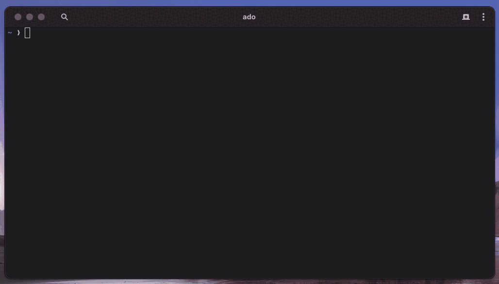

<h3 align="center">addsong</h3>

<p align="center">
  <a href="https://pypi.org/project/addsong/"></a>
  <a href="https://www.python.org/downloads/"></a>
  <a href="https://github.com/ado11231/addsong/blob/main/LICENSE"></a>
  <a href="https://github.com/yt-dlp/yt-dlp"></a>
  <a href="https://ffmpeg.org/"></a>
</p>

<p align="center">
  
</p>

<p align="center"><b>Paste a link and the song shows up in Apple Music.</b></p>

addsong takes a song name or a YouTube link. It downloads the track, tags it
with the title, artist, and cover art, then drops it into Apple Music. No
dragging files around, just a single command.

```bash
addsong "songname"
addsong "https://www.youtube.com/watch?v=..."
```

## Installation

You need Python 3.11 or newer, plus two tools that do the real work, yt-dlp
and ffmpeg. addsong itself is a Python package you install with pipx.

### 1. Install addsong

```bash
pipx install addsong
```

Don't have pipx yet? Install it first. On macOS run `brew install pipx`. On
Linux run `pip install --user pipx` (or use your distro's package). On Windows
run `pip install pipx`. Once pipx is set up, run `pipx ensurepath` and reopen
your terminal so addsong is on your PATH.

No pipx? `pip install --user addsong` works too.

### 2. Install yt-dlp and ffmpeg

These do the downloading and tagging. Pick the command for your system.

&nbsp; **macOS**

```bash
brew install yt-dlp ffmpeg
```

&nbsp; **Linux and WSL**

```bash
sudo apt-get install -y ffmpeg && pipx install yt-dlp
```

On other distros use your package manager for ffmpeg. yt-dlp can come from
pipx or pip.

&nbsp; **Windows** (PowerShell)

```powershell
winget install yt-dlp.yt-dlp Gyan.FFmpeg
```

### 3. Check it

```bash
addsong --version
```

## Updating

```bash
pipx upgrade addsong
```

With pip instead of pipx, run `python -m pip install --user --upgrade addsong`.

## Shell Completions

addsong can print a completion script for your shell. Source it or save it to
your shell's completion directory.

```bash
source <(addsong --print-completion bash)      # bash
addsong --print-completion zsh  > ~/.zsh/completions/_addsong   # zsh
addsong --print-completion fish > ~/.config/fish/completions/addsong.fish  # fish
```

See your shell's docs for where completion files go.

## Your First Song

```bash
addsong "songname"
```

addsong shows what it found so you can fix mistakes before saving.

```
  Review track ♪
  Artist: Artist Name
  Title:  Song Title

  [Enter] Add  ·  [E] Edit  ·  [S] Skip
  ❯
```

Press Enter and the song lands in Apple Music a second later.

## Commands


| Command                        | What it does                                    |
| ------------------------------ | ----------------------------------------------- |
| `addsong "name"`               | Add the top search result                       |
| `addsong "<link>"`             | Add a specific video                            |
| `addsong --results 3 "name"`   | Add the top 3 search results                    |
| `addsong --playlist "<link>"`  | Add a whole playlist                            |
| `addsong --from list.txt`      | Add every link in a file                        |
| `addsong subscribe "<link>"`   | Follow a playlist                               |
| `addsong sync`                 | Add new songs from playlists you follow         |
| `addsong list`                 | Show playlists you follow                       |
| `addsong unsubscribe "<link>"` | Stop following a playlist                       |
| `addsong forget`               | Forget everything added so it can be re-added   |


## Flags


| Flag                    | What it does                                           |
| ----------------------- | ------------------------------------------------------ |
| `-y`                    | Don't ask, just add it                                 |
| `--review`              | Always pause to fix the title or artist first          |
| `--reimport`            | Add a song again even if you already have it           |
| `--dry-run`             | Show what would happen without downloading            |
| `--format FMT`          | Output format, `m4a` (default), `mp3`, `flac`, `opus`  |
| `--quality N`           | Audio quality 0 to 10, 0 is best and the default       |
| `--notify`              | Pop a desktop notification as each song imports        |
| `--quiet` / `--verbose` | Show less or more output                               |
| `--help`                | Full list of commands and options                      |


Set environment variables like `ADDSONG_WATCH_DIR` to change defaults. Run
`addsong --help` for the full list.

## Download Location

On macOS and Windows songs go straight into Apple Music. On Linux they land
in `~/Music/addsong/`. Point them somewhere else with
`ADDSONG_WATCH_DIR=/your/folder`.

## Common Errors

If you see `command not found`, run `pipx ensurepath` and reopen your
terminal. Still stuck? Repeat the [Installation](#installation) step.

If a song downloads but never shows up, open the Apple Music app and keep it
open while adding (macOS or Windows).

If a download fails, update yt-dlp, then retry with `--verbose` to see why.