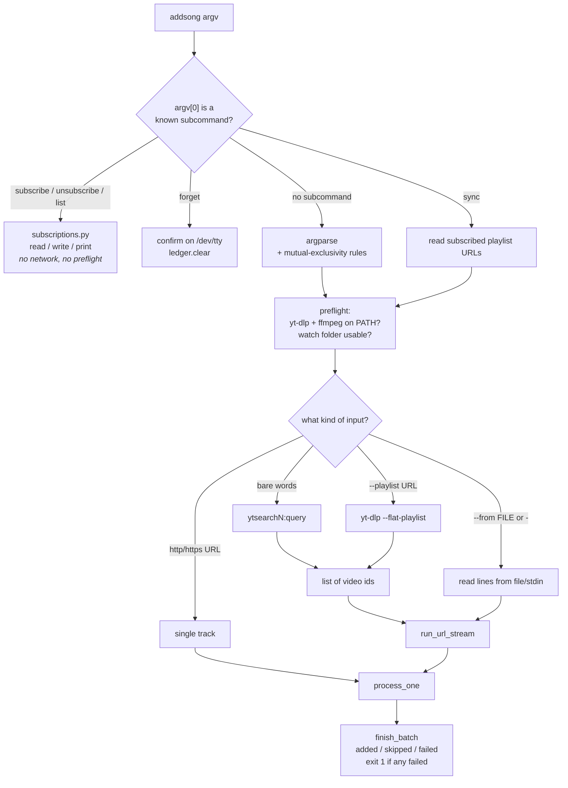
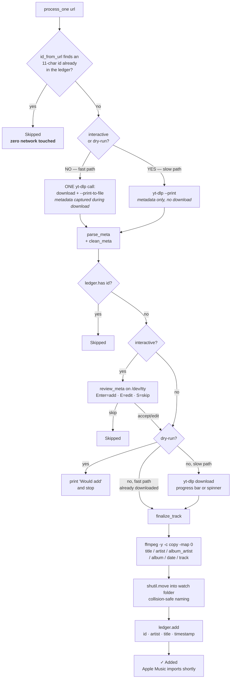

# addsong — Project Brief

**One line:** a CLI that takes a YouTube link or a song name and gets the tagged track into Apple Music, with no Apple API, no credentials, and no AppleScript.

`pipx install addsong` · Python ≥3.11 · MIT · [github.com/ado11231/addsong](https://github.com/ado11231/addsong)

---

## Contents

1. [The core idea](#1-the-core-idea)
2. [Pipeline diagrams](#2-pipeline-diagrams)
3. [File structure](#3-file-structure)
4. [Constraints](#4-constraints)
5. [Bash → Python](#5-bash--python)
6. [Interview run](#6-interview-run)
7. [Known gaps](#7-known-gaps)
8. [Fact sheet](#8-fact-sheet)

---

## 1. The core idea

Every obvious way to put a file into Apple Music is bad: the MusicKit API needs an Apple ID, AppleScript needs the app running and breaks on OS updates, and editing the library XML directly is asking for corruption.

All three are unnecessary. Apple Music on macOS, the Apple Music preview app on Windows 11, and legacy iTunes **all share one behavior**: each library continuously scans a folder called `Automatically Add to Music`. Drop a correctly tagged audio file in it and the library imports it on its own.

```
   addsong's responsibility ends here
                 │
                 ▼
  ~/Music/Music/Media.localized/Automatically Add to Music.localized/
                 │
                 │  Apple Music scans this folder by itself
                 ▼
            Your library
```

That single decision removes the daemon, the auth layer, the API client, and most of the error handling. The program reduces to: **produce a correct file, then move it.**

It also degrades well — if Music isn't running, the file is imported at next launch — and it makes the whole thing testable, because "did it work" is just "is there a file in this directory."

On Linux there's no Apple Music, so the tool falls back to writing tagged files into `~/Music/addsong` for manual import. Same pipeline, different destination.

---

## 2. Pipeline diagrams

### 2.1 Input dispatch

Everything funnels into one per-track function. The five entry shapes differ only in how they produce URLs.



Two details worth knowing:

- **The subcommand peek happens before argparse.** If `argv[0]` is `subscribe`/`unsubscribe`/`list`/`sync`/`forget` it's consumed as a subcommand and can never be mistaken for a URL.
- **Search is not a special case.** `ytsearch3:query` is just a pseudo-playlist URL to yt-dlp, so search reuses the exact same `--flat-playlist` expansion as a real playlist. Search-by-name shipped with **zero new dependencies** because of this.

### 2.2 Per track — `pipeline.process_one`



**Why two paths.** If the run is interactive or a dry-run, the metadata has to be readable *before* committing to a download — you can't show a review prompt for a track you've already fetched. If nobody's watching (a playlist import, a `sync`), that intermediate state is unobserved, so the two calls fuse into one. Halves the round trips on batch imports.

**Why dedup twice.** The first check is free and needs no network, but only works when the URL contains a parseable YouTube ID. The second catches everything else, once yt-dlp has told us the real ID.

### 2.3 Retry classification — `ytdlp.run_ytdlp`

Exit code alone is useless here: yt-dlp returns non-zero for a network blip *and* for a deleted video, and retrying a deleted video is pure latency.

```
        run yt-dlp
             │
        rc == 0? ──yes──▶ done
             │ no
             ▼
   grep stderr against YTDLP_HARD_ERRORS
   private · members-only · removed · terminated
   age-gated · region-locked · unavailable · copyright
             │
      ┌──────┴──────┐
    match         no match
      │               │
      ▼               ▼
  return now      attempt++ > retries? ──yes──▶ return
  (permanent)          │ no
                       ▼
              sleep(attempt × retry_delay)   ← linear backoff
                       │
                       └──────▶ retry
```

---

## 3. File structure

### 3.1 Repository

```
addsong/
├── src/addsong/                  # the package — 15 files, 2,396 lines
│   ├── __init__.py               #     3   __version__ (single source of truth)
│   ├── __main__.py               #     6   python -m addsong
│   ├── constants.py              #    46   formats, hard-error regex, exit codes
│   ├── config.py                 #   177   Config dataclass, env-over-file
│   ├── platform.py               #    92   detect_os, default_watch_dir
│   ├── meta.py                   #   198   clean_meta, safe_name, id_from_url, parse_meta
│   ├── ytdlp.py                  #   114   subprocess wrapper + retry classification
│   ├── ffmpeg.py                 #   133   tag with -c copy, move into watch folder
│   ├── ledger.py                 #    70   dedup TSV: has/add/clear/count/read_rows
│   ├── subscriptions.py          #    73   subscribed playlist URLs
│   ├── ui.py                     #   310   rich console, spinner, progress bar, notify
│   ├── review.py                 #   104   interactive accept/edit/skip on /dev/tty
│   ├── pipeline.py               #   483   Run/Flags, process_one, batch fns, preflight
│   ├── completion.py             #   195   generates bash/zsh/fish completion scripts
│   └── cli.py                    #   392   argparse, subcommand peek, dispatch, help
│
├── tests/                        # 257 tests, 2,089 lines, ~7.5s, zero network
│   ├── conftest.py               #   144   fake yt-dlp + ffmpeg on PATH, isolated tmp state
│   ├── test_cli.py               #   325   end-to-end through cli.main
│   ├── test_meta.py              #   323   clean_meta / safe_name / id_from_url
│   ├── test_pipeline_meta.py     #   282   parse_meta precedence rules
│   ├── test_platform.py          #   258   detect_os, watch-folder probing
│   ├── test_completion.py        #   163
│   ├── test_subscriptions.py     #   164
│   ├── test_ledger.py            #   138
│   ├── test_ui.py                #   108
│   ├── test_ytdlp.py             #    92   retry + hard-error behavior
│   └── test_config.py            #    91
│
├── .github/workflows/
│   ├── ci.yml                    # push + PR: ruff, mypy, pytest × {ubuntu, macos}
│   │                             #            + wheel build & pipx install smoke
│   ├── integration.yml           # manual only: real yt-dlp/ffmpeg vs a CC-BY track
│   └── release.yml               # on v* tag: build → publish via OIDC trusted publishing
│
├── docs/
│   ├── ARCHITECTURE.md           # module map, pipeline, state, exit codes
│   └── RELEASE.md                # version bump → tag → workflow
│
├── assets/                       # demo.gif, OS icons, badge SVGs
├── pyproject.toml                # hatchling, dynamic version, deps, tool config
├── ruff.toml                     # E,F,I,W,UP,B,SIM · line-length 100
├── README.md
└── LICENSE                       # MIT
```

### 3.2 Dependency layering

Each layer imports only from below it. No cycles.

```
┌──────────────────────────────────────────────────────────────┐
│  cli.py                argparse · subcommand peek · dispatch │
└──────────────────────────────┬───────────────────────────────┘
                               ▼
┌──────────────────────────────────────────────────────────────┐
│  pipeline.py           Run/Flags · process_one · preflight   │
└──────────────────────────────┬───────────────────────────────┘
                               ▼
┌───────────────┬───────────────┬──────────────┬───────────────┐
│  ui.py        │  review.py    │  ffmpeg.py   │  ytdlp.py     │
│  output       │  TTY prompt   │  tag + move  │  subprocess   │
└───────────────┴───────────────┴──────────────┴───────────────┘
                               ▼
┌───────────────┬───────────────┬──────────────┬───────────────┐
│  meta.py      │  ledger.py    │ subscriptions│  platform.py  │
│  strings      │  dedup state  │  .py         │  OS + paths   │
└───────────────┴───────────────┴──────────────┴───────────────┘
                               ▼
┌──────────────────────────────┬───────────────────────────────┐
│  config.py                   │  constants.py                 │
│  env-over-file resolution    │  pure data, zero imports      │
└──────────────────────────────┴───────────────────────────────┘
```

**The decoupling trick:** `ffmpeg.finalize_track()` takes `on_status`, `on_notify`, `on_add`, and `on_err` as injected callables rather than importing `ui` and `ledger`. That's what keeps the graph acyclic and lets tests assert on tagging without constructing a UI.

### 3.3 State on disk

All plain text. No database.

| Path | Format | Written by |
|---|---|---|
| `~/.local/state/addsong/imported.tsv` | `id\tartist\ttitle\tISO-8601`, append-only | every successful import |
| `~/.local/state/addsong/subscribed.tsv` | one URL per line, `#` comments preserved | `subscribe` / `unsubscribe` |
| `~/.config/addsong/config` | `ADDSONG_KEY=VALUE`, parsed — never executed | the user |
| `$TMPDIR/addsong.XXXX/` | staging dir, removed on success *and* failure | every track |

The ledger is the **only** source of truth for `sync`'s "just the new ones" behavior — there is no per-playlist cursor or last-seen marker. That's why `forget` is a complete reset.

---

## 4. Constraints

| Constraint | What it forced |
|---|---|
| **No Apple credentials or API** | Watch-folder handoff. Removed auth, the API client, and the "is Music running" problem entirely. |
| **yt-dlp/ffmpeg are subprocesses, not imports** | The interface is *text* — stdout parsing, stderr regex, exit codes. Buys total release decoupling from a volatile upstream at the cost of a typed contract. |
| **Four OS targets: mac / win / wsl / linux** | `detect_os()` reads `/proc/sys/kernel/osrelease` for the WSL marker; WSL globs `/mnt/[c-z]/Users/*/…` to find the Windows library; Linux degrades to output-only. |
| **stdout must stay clean** | *All* human output goes to **stderr**; spinner and progress render to `/dev/tty`. `list` is the only stdout writer. Keeps the tool pipeable. |
| **YouTube titles are garbage** | `clean_meta()` — five regex passes stripping `(Official Video)`, `[4K]`, `(feat. X)`, `- Topic`, dangling separators. The bracket pass loops until stable so nested junk collapses. |
| **Some network errors are permanent** | `YTDLP_HARD_ERRORS` classification — private/removed/age-gated/region-locked never retry; everything else gets linear backoff. |
| **Re-running must not duplicate** | Append-only ledger keyed by video ID, checked twice (once free, once post-metadata). |
| **No TTY in CI or pipes** | Every interactive feature has a non-TTY fallback. Icons render only when rich's `color_system` is non-None, so scripted greps still match plain output. |
| **Titles contain `[` and `]`** | rich markup must be escaped in `err/say/banner/status` — real crash found during the port. |
| **Staging and destination are different filesystems** | `shutil.move`, not `os.replace` — the latter raises `EXDEV` across mounts. |
| **Must survive the rewrite without breaking users** | On-disk formats frozen. Existing ledgers and subscription lists work unchanged across the Bash→Python upgrade. |

---

## 5. Bash → Python

### The arc

| Stage | State |
|---|---|
| First commit (`77182cc`) | **165 lines** of bash. One URL in, one file out. Header admits: *"No duplicate detection: re-running adds another copy."* |
| Peak bash (`b2cd662`) | **1,092 lines**, 33 functions, `process_one` ~120 lines. Plus a Homebrew formula, an AUR PKGBUILD, `install.sh`, `install.ps1`, and two hand-written completion files. |
| Today | **15 modules, 2,396 lines**, one runtime dependency, 257 tests, one distribution channel. |

### Why it had to move

1. **It wasn't really a bash script.** `clean_meta()` was a `perl -CSD -pe` one-liner, because bash can't do Unicode-aware regex. "Install this script" actually meant bash + perl + yt-dlp + ffmpeg. The port dropped Perl.
2. **Testing hit a ceiling.** bats could reach the CLI surface but not the internals. 49 cases was the practical limit → 257 now.
3. **Five distribution channels**, each needing a checksum bump per release. Now: PyPI.
4. **No types, no refactoring safety net** past ~1,000 lines.

### How the port ran — ten commits, bottom-up

```
 1  7c5d5f1  scaffold package + ruff/mypy/pytest; CLI stubbed to --version only
 2  c57c934  platform / path / config helpers
 3  54baedc  clean_meta regex → Python   ← drops the Perl dependency
 4  5d48a69  yt-dlp + ffmpeg subprocess layer
 5  dbef620  ledger + subscriptions       ← on-disk formats preserved
 6  c1ab20e  review + progress UI with rich
 7  6b51e58  CLI, pipeline, exit-code semantics
 8  775e95e  49 bats cases → 140 parametrized pytest tests
 9  bd87775  CI, installers, packaging switched to Python
10  2c5d850  docs rewritten; the 1,092-line bash script deleted
                                      merged as PR #27
```

Three things this got right:

- **The CLI was stubbed from commit one**, so `pip install -e .` and the console-script entry point stayed green the entire way. The alternative — port the CLI first, stub the internals — means nothing runs until the last commit and you debug ten layers at once.
- **The old test suite was the specification.** bats stayed alive until commit 9, acting as the parity oracle for the new implementation rather than being deleted early as dead weight.
- **The regex translation was verified output-for-output**, not eyeballed — both implementations run against every bats case plus a Unicode sample (Sigur Rós). That regex is the one place a subtle behavior change would silently corrupt metadata forever.

### Bugs the port surfaced

Recorded in the commit bodies, and all worth having ready as examples:

- `rich` was passing `force_terminal=True` even to a `StringIO`, baking the ✓ glyph into supposedly no-color output and breaking scripted greps.
- `finish_batch`'s colored summary was being escaped away by `say()` — fixed by splitting out a `say_markup()` that intentionally does *not* escape.
- Song titles containing `[` or `]` crashed the rich console until markup escaping was added to `err/say/banner/status`.
- `os.replace` → `shutil.move` for the cross-device watch-folder move (`EXDEV`).
- The `vorbis`/`alac` extension mismatch — yt-dlp's `--audio-format vorbis` produces `.ogg`, not `.vorbis`.

### After the port

`de03e1c` → `4ef617b` retired **Homebrew, AUR, and `curl | bash` entirely** in favor of PyPI + pipx, and deleted the static completion files in favor of `--print-completion` generating them on demand from a single declaration in `completion.py`.

---

## 6. Interview run

### 6.1 The 30-second version

> **addsong** is a command-line tool that takes a YouTube link or just a song name and gets the tagged track into your Apple Music library in one command. It's on PyPI, installable with pipx.
>
> The part I'd point to isn't the downloading — that's yt-dlp doing the work. It's that I got the Apple Music integration with **zero API access, zero credentials, and no AppleScript.** And that it started as a bash script that grew to about 1,100 lines before I rewrote it as a proper Python package.

Two threads for them to pull: the integration trick, and the rewrite. Both have depth.

> **Framing note:** this deliberately undersells the download and oversells the integration. "I wrapped yt-dlp" is a weekend project; "I found a way to write into a closed ecosystem without touching its API" is a design decision. Interviewers pattern-match on *which part you choose to lead with*.

### 6.2 The 2-minute version

> **The problem.** I wanted to paste a link and have the song appear in Apple Music, tagged properly, without dragging files around.
>
> **The obvious approach was wrong.** Everyone reaches for the Apple Music API or AppleScript. Both need an Apple ID or a running app, both break on OS updates, both are painful to test. So I went looking for something more stable — and Apple Music, the Windows preview app, and legacy iTunes all share one behavior: each library has an `Automatically Add to Music` folder that gets scanned continuously. Drop a correctly tagged file in it and it imports itself.
>
> **That collapses the whole program.** No daemon, no auth, no API client. The job becomes: produce a correct file, then move it. It also degrades gracefully — if Music isn't running, it imports next launch — and it's trivially testable, because "did it work" is just "is there a file in this directory."
>
> **So the pipeline is:** resolve the input — a URL, a search query, a playlist, a file of links, or a saved subscription. Check a local ledger so I don't re-download something I already have. Call yt-dlp for metadata and audio. Clean the metadata, because YouTube titles are full of junk like "Official Video" and "4K". Optionally prompt to fix the artist and title. Tag with ffmpeg. Move it into the watch folder. Record it.
>
> **And then the rewrite.** It was bash, and it hit about 1,100 lines with 33 functions before I moved it to Python. Now it's 15 modules with one runtime dependency, 257 tests, and it ships to PyPI through GitHub Actions with OIDC trusted publishing.

Then stop and let them choose.

### 6.3 Beats to have loaded

Don't recite these — deploy the one that matches the question.

**Why the bash had to go.** Four concrete reasons, because "it got long" is weak: the hidden Perl dependency; bats couldn't test internals; five distribution channels each needing a checksum bump; no types past 1,000 lines.

**How the rewrite ran.** Ten commits, bottom-up, CLI stubbed from commit one so the package stayed installable throughout. Two self-imposed constraints: on-disk formats don't change so existing users keep their history, and the regex translation gets verified output-for-output rather than eyeballed.

**Why subprocess instead of `import yt_dlp`.** Present it as a trade, not a win:

> One runtime dependency, `rich`, and only for output. The reason is release coupling — yt-dlp ships breaking changes constantly because YouTube changes constantly. If I imported it, every yt-dlp break would need an addsong release. Shelling out means users upgrade it independently and I never ship anything.
>
> The cost is that my interface is text instead of a typed API — parsing stdout, regex-matching stderr, reading exit codes. That's a worse contract, and it's exactly why there's a module wrapping the subprocess call and a hand-maintained regex classifying permanent errors. Right trade here, but it is a trade.

> **Framing note:** the shape is **decision → reason → cost → verdict.** Volunteering the downside before they find it is the fastest way to show you can see around your own decisions. An answer with no downside is an answer that wasn't thought about.

**The fast/slow path.** Two code paths for fetching. Interactive or dry-run makes a metadata-only call first, so the prompt can render before committing to a download. Non-interactive fuses download and metadata into one call, because nobody observes the intermediate state. Halves round trips on batch imports; costs a branch both paths must exit consistently.

**Two ffmpeg details that prove you shipped it.**

> The tagging uses `-c copy` and `-map 0` — no re-encode, so the audio passes through byte-for-byte and the cover art yt-dlp already embedded survives. The naive version re-encodes AAC to AAC and silently loses quality.
>
> And a bug I hit: I was using `os.replace` to move into the watch folder. Staging is in `/tmp`, the watch folder is under `$HOME`, and those are often different filesystems — `os.replace` raises `EXDEV` across mounts. `shutil.move` falls back to copy-and-delete. That's a bug you only hit on a real machine, never in a test where both paths are under `tmp_path`.

The second is a strong "tell me about a bug" answer because the punchline is *why the tests couldn't catch it*.

**Testing something that depends on YouTube.**

> The unit suite never touches the network. The fixture writes fake `yt-dlp` and `ffmpeg` shell scripts onto `PATH`, driven by environment knobs so a test can say "make the download fail" or "return this metadata." Ledger, subscriptions, and watch folder all redirect into a temp directory. 257 tests in about seven seconds.
>
> Separately there's a real integration workflow running actual yt-dlp and ffmpeg end to end against a Creative Commons track. That one's manual-trigger only — network flakiness in required CI is how you train a team to ignore red builds.

### 6.4 Follow-ups

**"Isn't this just a wrapper around yt-dlp?"** — the dismissive one. Concede and redirect:

> Downloading, yes, entirely — I'd be reinventing something excellent otherwise. What's mine is everything on either side: the Apple Music handoff, metadata cleaning, dedup, retry classification, and the fact that it's one dependency installing in one command on three platforms. The download is the part I deliberately didn't build.

**"Is this legal?"** — answer it directly; hedging looks worse.

> It's a frontend to yt-dlp, so it inherits the same posture — it's a tool, the use determines legality, and it's aimed at personal library management. One thing I did deliberately: the integration test uses a Creative Commons track from the Blender Foundation rather than commercial music, so CI isn't pulling copyrighted audio on every run.

That last detail does real work — it's evidence you thought about it before being asked.

**"How does the retry logic know what to retry?"**

> Exit code alone isn't enough — yt-dlp returns non-zero for a network blip and for a deleted video, and retrying a deleted video is pure latency. So the wrapper captures stderr to a file and regex-matches it against permanent conditions: private, members-only, removed, terminated, age-gated, region-locked. Those return immediately. Everything else gets bounded retries with linear backoff.
>
> *If they push:* the regex is too broad. Patterns like "is unavailable" and "copyright" will match yt-dlp output that isn't actually permanent, so some retryable failures get misclassified as fatal. Tuning it properly needs real-world stderr samples, and I've been tuning it from memory.

**"Walk me through the CI."**

> Three workflows. On every push and PR: ruff, mypy strict, pytest across Ubuntu and macOS — plus a second job that builds the wheel exactly the way the release does, pipx-installs it clean, and runs the console script. That job exists because lint and tests passing tells you nothing about whether the package is *installable* — a missing module or broken entry point sails straight past pytest.
>
> Releases fire on a `v*` tag and split into build and publish. The publish job holds the OIDC identity token and does nothing but download an artifact and upload it — build code never runs in the job holding the credential. And it's trusted publishing, so there's no long-lived PyPI token to leak or rotate.

**"Why rich? Why not click or typer?"**

> I needed formatted output, not argument parsing. argparse already covered parsing, and typer would pull in click plus its own surface for a problem I'd solved. One dependency, one job.

**"What was the hardest part?"** — the metadata. Not the download, not the tagging:

> Getting from a YouTube title to a correct artist and title. The precedence is: use YouTube Music's structured metadata if it's there, because it's already clean; otherwise try splitting on " - "; otherwise fall back to the uploader as artist. Then scrub bracketed junk, feat blocks, and "- Topic" suffixes off whatever came out. And it still gets things wrong often enough that there's an interactive review step, because a heuristic over user-generated titles is never going to be right every time.

### 6.5 The "what would you do differently" answer

The highest-signal question you'll get. Lead with the sharpest one.

> There's a bug I'd fix first. `--format` advertises `best` as an option and it's broken. The finalize step looks for a file at `{id}.{format}`, so with `best` it goes hunting for `VID.best` — but yt-dlp with `--audio-format best` keeps the source container, so the file is actually `.opus` or `.webm`. It needs a glob.
>
> The interesting part is why I missed it. There are 257 tests and **not one uses `best`, `vorbis`, or `alac`.** And it's worse than a coverage gap: my fake yt-dlp writes whatever extension it's handed, so it would happily create `VID000.best` — **the stub is more permissive than the real tool.** If I'd written that test it would have passed and told me nothing. That's the classic failure mode of hand-rolled fakes, and the lesson I took is that a stub has to be at least as strict as the thing it replaces, or it manufactures false confidence.
>
> Second: my CI matrix is Ubuntu and macOS, but I claim Windows support in the README — and Windows is exactly where the gap is. The interactive prompt and the progress bar both open `/dev/tty`, which doesn't exist on Windows. So on Windows there's no review prompt, no progress bar, and `forget` refuses to run without `-y`. That's a real degradation documented as working, and untested. A Windows runner would have surfaced it immediately.
>
> Smaller ones: my lint tooling is unpinned in CI, so a new ruff release can turn `main` red with no code change. The integration test is manual-only, which means the most likely cause of this tool breaking in the wild — an upstream yt-dlp change — gets found by users instead of a weekly cron. And the ruff config lives in both `ruff.toml` and `pyproject.toml`; ruff prefers the standalone file, so the pyproject copy is inert and will silently diverge the moment someone edits the wrong one.

> **Framing note:** what makes this land isn't humility — it's that every flaw comes with **a mechanism for why it wasn't caught.** "The stub was more permissive than reality" and "my matrix didn't cover the platform with the biggest gap" are transferable diagnoses, not confessions. The weak version of this answer is "I'd add more tests," which says nothing about how you think.

### 6.6 Two traps

**The commit history.** 219 commits, and **108 of them** — just under half — are single-test commits shaped like `test: clean_meta(pipe_in_middle)`, each adding five lines to one file, all landed at the end. Anyone who opens the repo sees it immediately and it reads as padding. If it comes up, own it in one sentence and pivot:

> The tail of that history is over-granular — I was committing per test case and it makes the log hard to read. The ten migration commits are the ones I'd point at: each scoped to one layer, with messages explaining the rationale, the bugs the port surfaced, and what was verified.

That's true, and those commits genuinely are strong. Don't let the tail bury them.

**Don't oversell the scale.** It's a well-built CLI tool, not a distributed system. Say "architecture" too many times and the interviewer starts looking for complexity that justifies the word. The framing that fits — and that this project fully supports — is: *small tool, a handful of decisions I can defend, and I know exactly where it's weak.*

---

## 7. Known gaps

Verified against the code. Useful both as a fix list and as honest interview material.

### Real bugs

| Issue | Where | Detail |
|---|---|---|
| **`--format best` is broken** | `ffmpeg.py:66`, `pipeline.py:231` | Looks for `{id}.best`; yt-dlp keeps the source container. `_fmt_to_extension` maps `vorbis→ogg` and `alac→m4a` but passes `best` through. Its own docstring describes a glob-based fix **that was never written**. |
| **No test can catch it** | `tests/conftest.py` | Zero tests use `best`, `vorbis`, or `alac` — and the yt-dlp stub writes whatever extension it's handed, so a test would pass either way. |
| **Windows has no TTY path** | `ui.py`, `review.py` | Both open `/dev/tty`, which doesn't exist on Windows. No review prompt, no progress bar, no spinner; `forget` refuses without `-y`. README claims Windows support; CI doesn't test it. |

### Dead code the linters can't see

- `Flags.playlist`, `Flags.from_file`, `Flags.results` (`pipeline.py:41,46,47`) — set, never read.
- `pipeline.py` imports `re` (line 12), never uses it, then lists `"re"` in `__all__` (line 482) — which is the only reason ruff's F401 stays quiet. You're re-exporting the `re` module by accident.
- `_emit_help()` in `cli.py` — defined, never called.
- `constants.py` has duplicated comment lines from copy-paste.

### Config drift

`ruff.toml` and `pyproject.toml:46-56` hold the same config twice. Ruff prefers `ruff.toml`, so the pyproject block is inert and will diverge.

### CI gaps

- No Windows runner (see above).
- `pip install ruff mypy pytest` unpinned — a new release can redden `main` with no code change.
- Integration test is `workflow_dispatch`-only; a weekly `schedule:` cron would catch upstream yt-dlp breakage before users do.
- Nothing verifies the git tag matches `__version__`. Pushing `v1.2.0` while `__init__.py` says `1.1.0` publishes a wheel named `1.1.0`.
- No coverage measurement — and as `--format best` shows, the gaps are real.

### Design nits

- `ledger.has()` is an O(n) full-file scan **per track** (`ledger.py:19`). A 100-track playlist against a 10,000-row ledger is a million line comparisons. Loading IDs into a `set` once per run turns O(n·m) into O(n+m).
- `YTDLP_HARD_ERRORS` is too broad — `is unavailable` and `copyright` will match transient output, misclassifying retryable failures as fatal.
- `Config.state_dir()` derives a directory from `Path(self.ledger).parent` — a custom `ADDSONG_LEDGER` sends it somewhere surprising.
- No `history` subcommand, despite `ledger.read_rows()` existing specifically to power it. Data layer written, feature never built.

---

## 8. Fact sheet

Numbers worth having exact.

| | |
|---|---|
| **Bash, first commit** | 165 lines |
| **Bash, final** | 1,092 lines · 33 functions |
| **Python source** | 15 files · 2,396 lines |
| **Python tests** | 257 tests · 2,089 lines · ~7.5s · zero network |
| **Runtime dependencies** | 1 — `rich>=13` |
| **External binaries** | `yt-dlp`, `ffmpeg` (+ optional `terminal-notifier` / `osascript` / `notify-send`) |
| **Python required** | ≥3.11 |
| **Total commits** | 219 (108 are single-test commits) |
| **Port** | 10 commits, PR #27 |
| **Distribution channels** | was 5 (Homebrew, AUR, curl\|bash, PowerShell, manual) → now 1 (PyPI) |
| **Published version** | 1.0.1 |
| **Exit codes** | 0 added · 2 skipped · 1 failed; batch exits 1 if any track failed |
| **CI matrix** | ubuntu-latest × macos-latest, Python 3.11 |
| **Build backend** | hatchling, `dynamic = ["version"]` from `src/addsong/__init__.py` |
| **Release auth** | OIDC trusted publishing — no stored token |
| **Lint/type** | ruff (E,F,I,W,UP,B,SIM) · mypy `--strict` |
