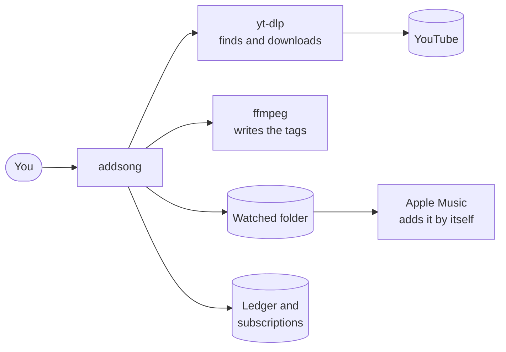
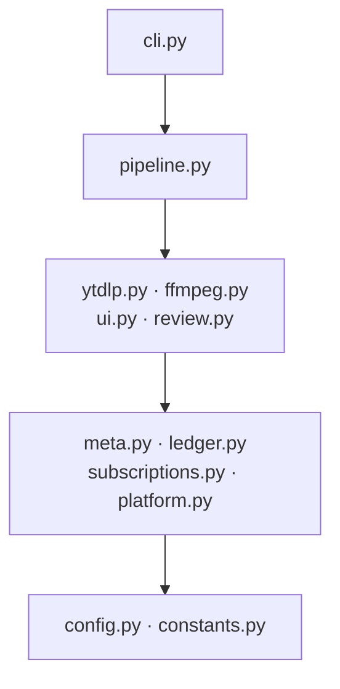
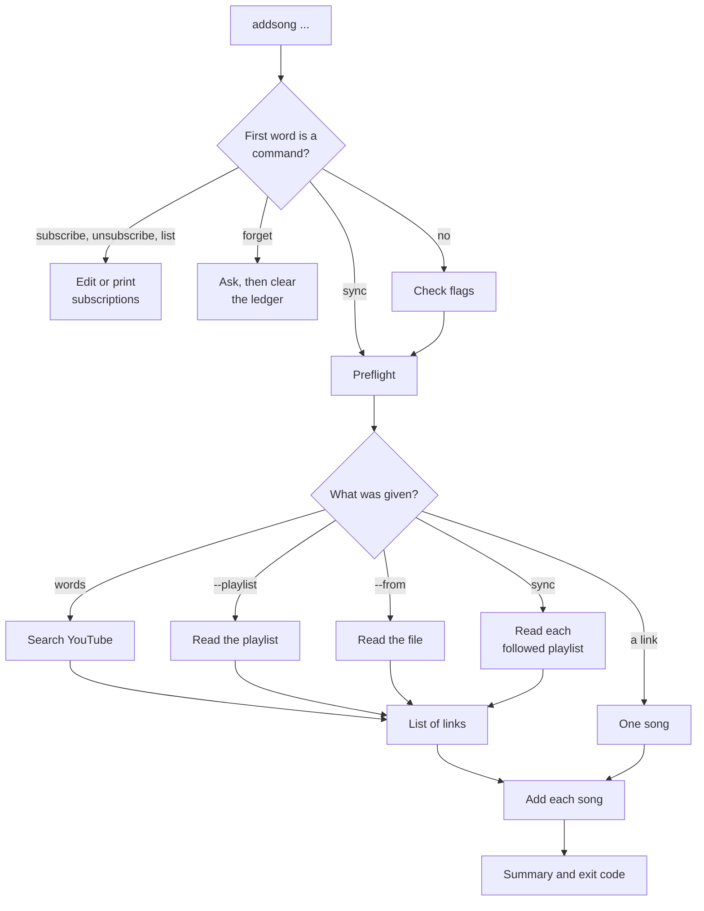
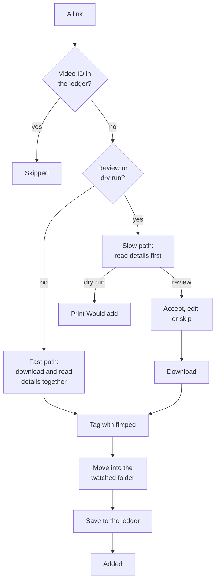
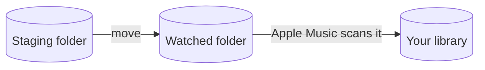
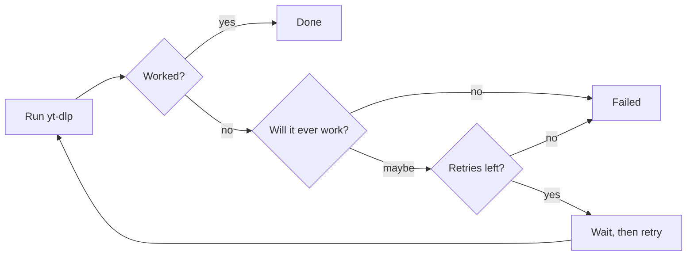

# Architecture

* How the code is organized, what each file does, and how a song goes from a link to Apple Music.
* For anyone working on the code. To learn what addsong does, read [FEATURES.md](FEATURES.md).

## Contents

1. [Overview](#overview)
2. [Key Terms](#key-terms)
3. [The System At A Glance](#the-system-at-a-glance)
4. [Files](#files)
5. [How The Code Is Layered](#how-the-code-is-layered)
6. [How A Command Runs](#how-a-command-runs)
7. [Adding One Song](#adding-one-song)
8. [Cleaning Song Details](#cleaning-song-details)
9. [Handing Off To Apple Music](#handing-off-to-apple-music)
10. [Errors And Retries](#errors-and-retries)
11. [Exit Codes](#exit-codes)
12. [Where Data Is Stored](#where-data-is-stored)
13. [Output](#output)
14. [Dependencies](#dependencies)
15. [Testing](#testing)
16. [Building](#building)
17. [Branches And Releases](#branches-and-releases)

## Overview

* addsong is a Python package with one command, `addsong`.
* It runs, adds the songs, and exits. There is no background service.
* Three ideas shape the design:

1. **Apple Music does the import.** addsong puts a tagged file in the folder Apple Music watches. It never signs in to Apple, uses an Apple API, or controls the Music app.
2. **addsong wraps proven tools.** yt-dlp downloads the audio, and ffmpeg writes the tags. Both run as separate programs, so a new version of either needs no change to addsong.
3. **Every input becomes a list of links.** A search, a playlist, a file, and a sync all turn into links, and each link goes through the same steps.

## Key Terms

| Term | Meaning |
| --- | --- |
| **yt-dlp** | The program that searches YouTube, reads video details, and downloads the audio. |
| **ffmpeg** | The program that writes the tags into the audio file. |
| **Tags** | Details stored inside a song file, such as the title and artist. |
| **Watched folder** | The "Automatically Add to Music" folder. Apple Music adds anything put there. |
| **Ledger** | The history file. One line for each song added, used to skip songs you have. |
| **Subscriptions** | The file of playlist links you follow. |
| **Staging folder** | A temporary folder for one song while it downloads and gets tagged. |
| **Video ID** | The 11 character code that names a YouTube video, such as `dQw4w9WgXcQ`. |
| **TTY** | A real terminal window, as opposed to a script or a pipe. |
| **Preflight** | The checks that run before any download. |

## The System At A Glance



* addsong only talks to yt-dlp, ffmpeg, and files on disk.
* Apple Music finds the new file on its own.

## Files

```text
addsong/
├── pyproject.toml             Package details, version source, tool settings
├── ruff.toml                  Lint rules
├── src/addsong/               The package
├── tests/                     The tests, which never go online
├── docs/
├── assets/                    Demo, icons, and badges for the README
└── .github/workflows/         CI, the manual end to end test, and releases
```

| File | Purpose |
| --- | --- |
| `__init__.py` | Holds the version. This is the only place it is set. |
| `__main__.py` | Lets `python -m addsong` work. |
| `cli.py` | Reads the command and flags, checks they make sense, and starts the right step. Also prints `--help`. |
| `pipeline.py` | The main steps: adding one song, adding a list, search, playlist, file, sync, forget, the summary, and preflight. |
| `meta.py` | Cleans titles, reads a video ID from a link, reads the details yt-dlp prints, and makes names safe for files. |
| `ytdlp.py` | Runs yt-dlp, and retries when a failure might work next time. |
| `ffmpeg.py` | Runs ffmpeg to write the tags, then moves the file into the watched folder. |
| `ledger.py` | Reads and writes the history file. |
| `subscriptions.py` | Reads and writes the followed playlists file. |
| `review.py` | The review question before a download, and the question before `forget`. |
| `ui.py` | Everything printed: messages, the spinner, the progress bar, the summary, and notifications. |
| `platform.py` | Works out the system, and where the watched folder is on it. |
| `config.py` | Reads settings from the settings file and environment variables. |
| `constants.py` | Fixed values: formats, default settings, errors not worth retrying, and exit codes. |
| `completion.py` | Prints shell completion scripts for bash, zsh, and fish. |

## How The Code Is Layered



* Each layer only uses the layers below it. Nothing uses a layer above it.
* `ffmpeg.py` does not use `ui.py` or `ledger.py`. The pipeline passes it small functions to call instead, for messages and for saving to the ledger. This keeps the layers clean, and lets tests check tagging on its own.
* `constants.py` uses nothing.

## How A Command Runs



1. `cli.py` first checks if the first word is a command, such as `sync`. A command is never mistaken for a search.
2. `subscribe`, `unsubscribe`, `list`, and `forget` only touch files, so they skip preflight.
3. Otherwise the flags are checked. Only one of a link, `--results`, `--playlist`, or `--from` may be used.
4. Words that are not a link become a search for the top result.
5. Preflight checks that yt-dlp and ffmpeg are installed and the watched folder exists. On Linux it creates the folder.
6. A search, a playlist, and a sync all ask yt-dlp for a list of video IDs. A search is just a playlist to yt-dlp, so they share the same code.
7. Each link goes through [Adding One Song](#adding-one-song).
8. A list ends with a summary of added, skipped, and failed songs.

## Adding One Song



1. **Check the ledger first.** If the link has a YouTube video ID already in the ledger, the song is skipped without going online. `--reimport` turns this off.
2. **Pick a path.**
   * **Fast path:** with no review and no dry run, one yt-dlp call downloads the audio and saves the details at the same time.
   * **Slow path:** for a review or a dry run, yt-dlp reads the details first, without downloading. Nothing is downloaded until you accept.
3. **Read the details.** See [Cleaning Song Details](#cleaning-song-details).
4. **Check the ledger again.** Links that are not normal YouTube links have no video ID to check in step 1, so the ID from the details is checked here.
5. **Review.** On the slow path, you accept, edit, or skip. A dry run prints `Would add` and stops.
6. **Download.** yt-dlp saves the audio and cover art into a new staging folder.
7. **Tag.** ffmpeg writes the title, artist, album artist, album, year, and track number. It copies the audio as is, so nothing is converted twice and the cover art stays.
8. **Move.** See [Handing Off To Apple Music](#handing-off-to-apple-music).
9. **Save.** The song is added to the ledger, `Added` is printed, and a notification shows if `--notify` is on.
10. The staging folder is removed, whether the song worked or failed.

## Cleaning Song Details

* yt-dlp prints 8 details: ID, title, channel name, track, artist, album, year, and track number. Missing ones print as `NA`, which becomes empty.
* The artist and title come from the first rule that fits:

| Order | If | Then |
| --- | --- | --- |
| 1 | YouTube Music gave a track and an artist | Use them as they are. |
| 2 | The title has ` - ` in it | The part before is the artist, the part after is the title. |
| 3 | Neither | The channel name is the artist, and the video title is the title. |

* In rules 2 and 3, `clean_meta()` then removes extra words:

| Removes | Example |
| --- | --- |
| Words in brackets like video, audio, lyrics, HD, 4K, and remastered | `(Official Video)`, `[4K]`, `(Remastered 2014)` |
| Featured artists | `(feat. X)`, `[ft. X]` |
| The ending YouTube adds to music channels | `Artist - Topic` |
| Leftover dashes and bars at the start or end | `Title -` |
| Extra spaces | `Song   Name` |

* Brackets inside brackets are removed by repeating the pass until nothing changes.
* If cleaning leaves the title empty, the original title is used.

## Handing Off To Apple Music



* The file is named `Artist - Title.m4a`. Slashes, backslashes, and colons in names become `_`.
* If that name is taken, the time is added to the name, so nothing is overwritten.
* The file is moved with `shutil.move`, which also works when the staging folder and the watched folder are on different disks.
* addsong's job ends once the file is moved. If Music is closed, it adds the file the next time it opens.
* How the folder is found:

| System | How |
| --- | --- |
| macOS | A fixed path in `~/Music`. |
| Windows | Tries the Apple Music app folder, then the iTunes folder. |
| WSL | Looks for the same Windows folders under `/mnt/c` to `/mnt/z`. Found by reading `/proc/sys/kernel/osrelease`. |
| Linux | `~/Music/addsong`, created if missing. |

* `ADDSONG_WATCH_DIR` always wins.

## Errors And Retries



* Some errors will never work, such as a private, removed, region locked, or age restricted video. These are listed in `YTDLP_HARD_ERRORS` and fail right away.
* Other errors retry. The default is 2 retries, waiting 3 seconds, then 6.
* yt-dlp's own messages go to a file in the staging folder. The last line with "error" in it is shown when a song fails. `--verbose` shows all of it.

## Exit Codes

| Code | One Song | Whole Run |
| --- | --- | --- |
| `0` | Added | Nothing failed |
| `2` | Skipped, because it was in the ledger or you skipped it | Not used |
| `1` | Failed | At least one song failed |

* A song's code is only used inside the pipeline to count the summary. The program itself only exits with `0` or `1`.
* `forget` exits with `1` if it is not in a terminal and `-y` was not given, because it will not clear the ledger without asking.

## Where Data Is Stored

* Everything is plain text. There is no database.

| File | Holds | Written By |
| --- | --- | --- |
| `~/.local/state/addsong/imported.tsv` | The ledger. One line per song: ID, artist, title, and time, split by tabs. | Each added song. `forget` deletes it. |
| `~/.local/state/addsong/subscribed.tsv` | One playlist link per line. Lines starting with `#` are kept. | `subscribe` and `unsubscribe` |
| `~/.config/addsong/config` | `ADDSONG_` settings, one per line. | You |
| A temporary staging folder | One song while it downloads. | Each song. Removed when done. |

* `~/.local/state` follows `XDG_STATE_HOME` when it is set.
* The ledger is the only way `sync` knows which songs are new. There is no separate record per playlist. This is why `forget` resets everything.
* These file formats do not change between versions, so an upgrade keeps your history and playlists.

## Output

* Messages go to stderr, the error stream. Normal output, stdout, stays clean, so `addsong` works in scripts and pipes.
* Only `list`, `--help`, `--version`, and `--print-completion` write to stdout.
* The spinner, progress bar, and review question use the terminal directly, through `/dev/tty`. If there is no terminal, they are skipped.
* Color uses the `rich` library. It turns off with `--no-color`, `NO_COLOR`, or when not in a terminal.
* Notifications use `terminal-notifier` or `osascript` on macOS, and `notify-send` on Linux.

## Dependencies

| Need | Uses |
| --- | --- |
| Colors, spinner text, and the progress bar | `rich`, the only Python dependency |
| Search, details, and downloads | `yt-dlp`, run as a separate program |
| Writing tags | `ffmpeg`, run as a separate program |
| Reading flags | `argparse`, part of Python |
| Building the package | `hatchling` |
| Lint, types, and tests | `ruff`, `mypy` in strict mode, and `pytest` |

## Testing

* `pytest` runs every test without going online.
* `tests/conftest.py` puts fake `yt-dlp` and `ffmpeg` programs first on the `PATH`, and gives each test its own folders. Settings in the test turn on fake failures.

| File | Covers |
| --- | --- |
| `test_cli.py` | Whole runs through `cli.main`, flags, and exit codes |
| `test_meta.py` | Title cleaning, safe names, and reading IDs from links |
| `test_pipeline_meta.py` | Which artist and title rule wins |
| `test_platform.py` | Finding the system and the watched folder |
| `test_ytdlp.py` | Retries and errors not worth retrying |
| `test_ledger.py` | The ledger file |
| `test_subscriptions.py` | The subscriptions file |
| `test_config.py` | Settings from the file and environment |
| `test_ui.py` | Output and colors |
| `test_completion.py` | The shell completion scripts |

* To run the checks yourself:

```bash
pip install -e .
pip install ruff mypy pytest
ruff check .
mypy src/addsong
pytest -q
```

## Building

* Needs Python 3.11 or later.

| Workflow | Runs On | What It Does |
| --- | --- | --- |
| `ci.yml` | Every push to `main` and every pull request | Ruff, mypy, and pytest on Ubuntu and macOS. Then builds the package, installs it with pipx, and runs `addsong --version`. |
| `integration.yml` | Started by hand from the Actions tab | Installs the real yt-dlp and ffmpeg, adds one freely licensed song, and checks a file was made. |
| `release.yml` | A pushed `v` tag, such as `v1.0.1` | Builds the package and publishes it to PyPI. See [RELEASE.md](RELEASE.md). |

* The end to end test is not part of normal CI, because going online makes it fail at random.

## Branches And Releases

* Commit messages follow the form `type(area): summary`, such as `test(meta): ...` or `docs: ...`.
* The version is set only in `src/addsong/__init__.py`.
* Every release goes through a tag and the release workflow. The steps are in [RELEASE.md](RELEASE.md).
