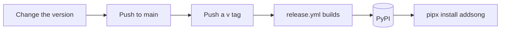

# Release

* How a new version of addsong gets to PyPI.
* For anyone publishing a release.

## Contents

1. [Overview](#overview)
2. [One Time Setup](#one-time-setup)
3. [Make A Release](#make-a-release)
4. [What The Workflow Does](#what-the-workflow-does)
5. [Pull A Bad Release](#pull-a-bad-release)

## Overview



* addsong is published to [PyPI](https://pypi.org/project/addsong/), the Python package index, by `.github/workflows/release.yml`.
* The workflow uses trusted publishing. PyPI trusts this repository's workflow directly, so no API token is stored.

## One Time Setup

* Done once, before the first release.

1. Open the [publishing settings](https://pypi.org/manage/project/addsong/settings/publishing/) on PyPI.
2. Add a trusted publisher with these values:

| Field | Value |
| --- | --- |
| PyPI project name | `addsong` |
| Owner | `ado11231` |
| Repository name | `addsong` |
| Workflow name | `release.yml` |
| Environment name | `pypi` |

* If the repository is renamed, update the repository name here too, or publishing fails.

## Make A Release

1. Set the new version in `src/addsong/__init__.py`. This is the only place it is set.

```python
__version__ = "1.1.0"
```

2. Commit and push to `main`.

```bash
git add src/addsong/__init__.py
git commit -m "release: 1.1.0"
git push
```

3. Wait for CI to pass on `main`.
4. Make a tag that matches the version, with a `v` in front, and push it.

```bash
git tag -a v1.1.0 -m "addsong 1.1.0"
git push origin v1.1.0
```

5. Watch the "Release (PyPI)" run in the Actions tab.
6. When it passes, check the new version:

```bash
pipx upgrade addsong
addsong --version
```

* Nothing checks that the tag matches `__version__`. If they differ, PyPI gets the version in `__init__.py`. Check both before pushing the tag.

## What The Workflow Does

| Step | What Happens |
| --- | --- |
| 1. Build | Builds the wheel and the source package with `python -m build`. |
| 2. Check | Installs the wheel and runs `addsong --version`. |
| 3. Publish | Uploads both to PyPI, using the `pypi` environment. |

* A wheel is the ready made package that `pip` and `pipx` install.

## Pull A Bad Release

* PyPI never accepts the same version twice, even after it is deleted.

1. Delete or yank the bad version on the PyPI project page. Yanking hides it from new installs, but keeps it for anyone who asked for that exact version.
2. Fix the problem.
3. Release again with a higher version, even if only the last number changes.
